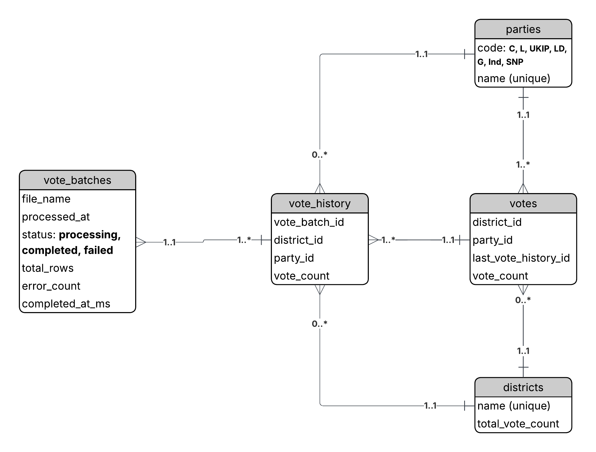

#  <center> Lissabon Election Day <center>

Application Demo: https://youtu.be/6wrpbNJq1aA
<br />
Application link: https://election-day-frontend.onrender.com/

This project simulates an election scenario in Lisbon, Portugal, where results arrive progressively from 24 constituencies and are contested by 6 political parties:

- Partido Social Democrata
- Partido Socialista
- Pessoas–Animais–Natureza
- Iniciativa Liberal
- Chega
- Livre

This project applies correctness under evolving data, real-time visibility, historical traceability, and reliable aggregation. Citizens can therefore understand and visualize the election standing in real-time.
<br/>
Besides, members of CNE can upload the election results at any moment.

## Features

#### Overall
- Data Visualization
- Real-time update as vote comes in
- Upload file with progression status

#### Broad
- Total voting citizens
- See the winning party, its total votes and turnout (national vote share)
- Members of Parliament seats won per party
- District votes, its national share, the winning party, vote distribution per party, Track votes over time (historical votes)
- Vote distribution per party
- Vote distribution per district
- Track votes over time (historical votes)
- Upload election poll, with real-time progress status and wide broadcasting to every user

# <center> How to Run / Execute <center>
First, ensure that you have Docker installed. Then, on the project root folder run the following command:

```bash
docker compose up --build
```
For more detailed explanation, please see [DOCKER.md](./DOCKER.md).


# <center> How to Ingest Data <center>
<i> Always open two tabs (or computer + phone) to see the real-time effect </i>. <b>Make sure your tab is allowed to play sounds</b>.

I took the liberty of adjusting the "data example" to make the project more real. Therefore, see to the folder `voting-polls` for the possible data to ingest.
<br />
> <i> It is still possible to ingest other districts/constituencies, but those will not be displayed in the map. </i>
<br />
<i> The parties <b>MUST BE</b> the ones available in the examples, otherwise the system will fail gracefully. </i>

There are three major ways of running this project to understand progressively how it mimics real world scenarios:

1. When the project starts, run the <b>SEED</b> to ingest data priori <3 days. This will allow you to subsequently upload new data and see how it evolves

```bash
cd backend && npm run seed
```

2. Manually ingest data one by one using the folder `./voting-polls/three-day-voting`. For each data ingested, observe how the platform behaves and presents the data as if it was a real-world scenario.

3. Manually ingest the data that mimics a `10 day election`, by using the file in `./voting-polls/seed-lisbon-10day`.

<b> ⚠️ Between the steps above, make sure the database is reseted every time, and hard refresh your browser. </b>

```bash
docker compose down -v && docker compose up --build
```

Then run the seed in another terminal:

```bash
cd backend && npm run seed
```


<i>ℹ️ Throughout the codebase comments have been left to throtle the data ingestion. Uncomment those marked with `// Testing:`, or use the production link to have a feeling how data is processed https://election-day-frontend.onrender.com/
</i>
# <center> Technologies <center>
#### Backend
- Fastify
- Prisma ORM
- [Bruno API Specs ](https://www.usebruno.com/) - A fully open source alternative to Postman
- Server-Sent-Events (SSE)

#### Frontend
- React + Vite.js
- Tanstack Router
- Tanstack Query
- Ant Design
- AntV (G2)
- JSX SVG - full custom code to make the Lisbon map interactable

#### Remarks

As far as code design goes, the backend uses "features slices" where each feature is an independent and self-isolating module (controller, types, and usecases).

Regarding the realtime update, it could have been done by two major ways:

1. Use a BaaS to store data and provide real-time subscription, with possible downside of the frontend having to manage custom and complex querys for advanced use cases.
2. Implement Websockets with possibility of “firing and forget” (query/subscribe and everything is handled).
3. <b>Server-Sent-Events (SSE)</b>

I chose <b> Server-Sent-Events (SSE) </b> for its simplicity but also because for Dashboards the connection is unidirectional. When new results are ingested:

1. the backend broadcasts an update event
2. clients refetch aggregated data
3. the UI updates to reflect the latest results
 <br/>
For the sake of simplicity, whenever data changes (votes are uploaded), the frontend refetches all the information instead of implementing <i>Data Syncronization</i> mechanism ([have a look at this real-time data sync mechanism](https://github.com/RTAndrew/betolyn/blob/main/mobile/server-sent-events/data-sync.ts)).

# Tools
- 2012 Lisbon Official Parishes Limit (geoJSON) - [lisboa.pt](dados.cm-lisboa.pt/en/dataset/freguesias-2012)
- [MapShaper](https://mapshaper.org/) - for converting the geoJSON into SVG
- [https://geojson.io](https://geojson.io/#map=11.92/38.73842/-9.16214) - for visualizing the geoJSON data


# Database schema


<b> Districts (Constituencies) </b> Holds all the districts as they are ingested into the platform

<b> Parties </b> Holds all the districts as they are ingested into the platform

<b> Vote Batches </b> gives system transparency by registering the "person" responsible for each vote ingestion. <br/>
Besides, it can also later be used along side of a <i>Message Queue</i> to proccess the ingestion asyncronously.

<b> Vote History </b> behaves like the <i>source of thruth</i> of all votes ingested into the system. It is also used to provide historical data visualization per district and per party.

<b> Vote </b> is the projection and each ingested votes, and reenforces the concept of overriding the votes already submitted.

